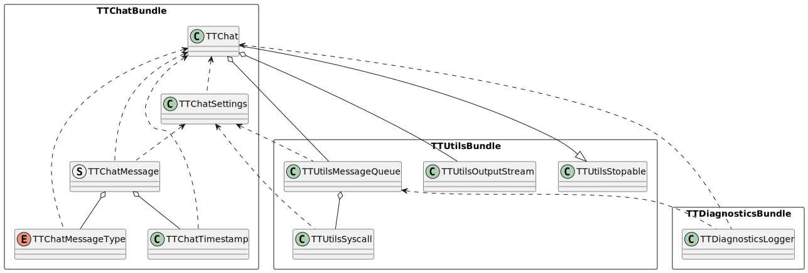
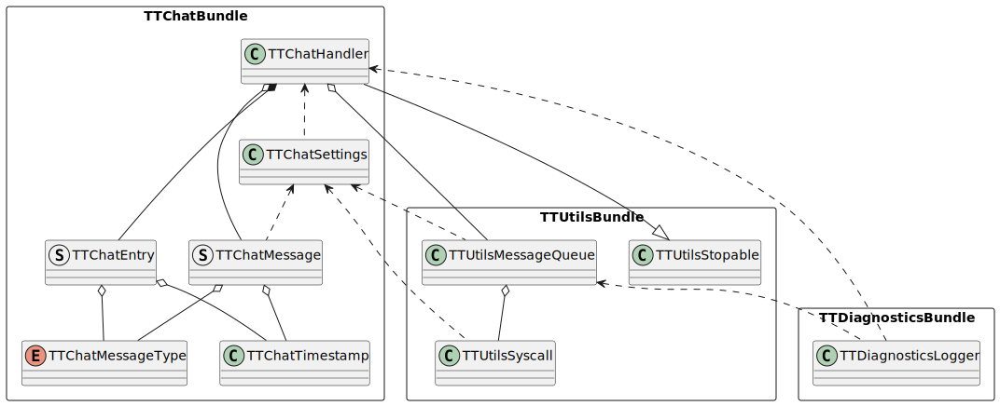

# Terminal Teams TextBox
## About
The purpose of this module is to:
- work as an user output interface based on terminal dimensions
- display chat (messages, timestamps)

Example terminal emulator output of running model:
```
                     1970-01-01 01:00:00
                Hello John, how are you?

1970-01-01 01:00:00
Hi Freddie, good and you?
```

## Architecture
This module consists of two main components:
- TTChat - binary, end user application (process)
- TTChatHandler - library, sender used in external binary (another process)




## Communication
Both components use IPC for communication (two message queues). Message types taking part in the flow:
- clear
- sender
- sender chunk
- receiver
- receiver chunk
- heartbeat
- goodbye

Since message queue has a limited number of messages in a queue and limited buffer per element, this module implements partial messages called chunks. Each chunk messages is assembled into one message on the recever side. Happy path of initialization and example communication can be found down below.

