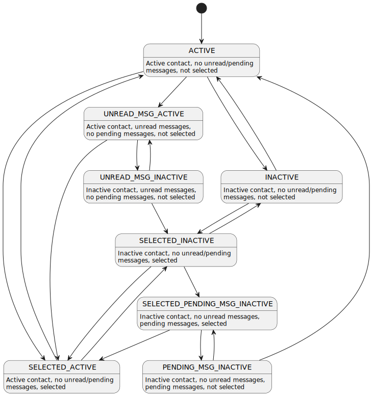

# Terminal Teams Contacts
## About
The purpose of this module is to:
- display available contacts
- display contacts statuses

Example terminal emulator output of running model:
```
#0 You <
#1 Nick ?
#2 David @
```

## Architecture
This module consists of two main components:
- TTContacts - binary, end user application (process)
- TTContactsHandler - library, controller used in external binary (another process)


## States
Each contact (an entry) consists of identity (numeric value and hash), nickname, IP address, port and state. There are also statistics gathered for each contact like number of sent messages and number of received messages. Each contact can be in one of the following state:
- ``` ``` - active
- ```?``` - inactive
- ```<``` - selected, active
- ```<?``` - selected, inactive
- ```@``` - active, unread messages, no pending messages
- ```@?``` - inactive, unread messages, no pending messages
- ```!?``` - inactive, pending messages
- ```<!?``` - selected, inactive, pending messages



## Communication
Both components use IPC for communication (shared memory and system semaphores). Message types exchanged between components:
- state
- heartbeat
- goodbye

Happy path of initialization and example communication can be found down below.

