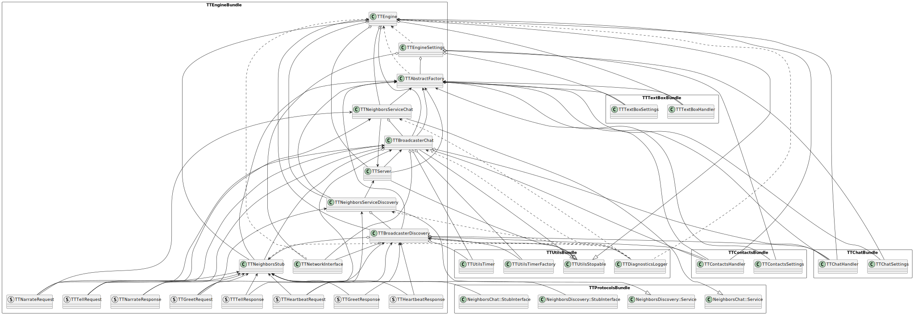

# Terminal Teams Engine
## About
Engine is the key module of Terminal Teams. Engine handles LAN communication using gRPC and protocol buffers through services. This module ensures proper communication across other modules, connects services with handlers and is responsible for global synchronization. Engine works as a backbone backend service thus there is no user interface to interact with.

## Architecture
This module consist of one main component that implements:
- services - so called gRPC services for neighbors discovery and neighbors chat, inbound message handlers
- broadcasters - inbound/outbound message handlers
- stub - so called gRPC stub, outbound message handler

## Communication
Engine does not include any IPC communication, after handlers and the first contact creation service chat and service discovery is setup to run gRPC server in the separate thread. After that, broadcaster chat and broadcaster disccovery is setup and run in separate threads. Engine monitors each component state (stopped/running). If all of the sudden any component has stopped engine will make sure that other components will be stopped too. Engine connects input component (textbox) with output components (contacts and chat) via callbacks:
- contacts selection
- mailbox

### Services
There are two types of services that work as an frontend:
- chat service
- discovery service

Discovery service handles incoming heartbeat and greet messages. It communicates with broadcaster discovery and forward converted packets to it. Similarly, chat service handles incoming tell and narrate messages. It communicates with broadcaster chat and forward converted packets to it.

### Broadcasters
There are two types of broadcasters that work as an backend:
- chat broadcaster
- discovery broadcaster

Each broadcaster communicates with contacts and chat handlers (seperate modules). Only chat broadcaster uses data from textbox handler. Chat broadcaster handles incoming and outcoming tell and narrate requests/responses. On the other hand, discovery broadcaster handles incoming and outcoming heartbeat and greet requests/reponses. Both broadcasters implement specific algorithm, in a nutshell:
- chat broadcaster - collects messages to be sent and after specific time (lazy send) 3000-6000ms sends tell request or narrate request depending on number of collected messages, apart from that after reception of tell request or narrate request it informs handlers about the message
- discovery broadcaster - tries to send greet request to the neighbors on engine startup (few attempts are made), handles reception of greet requests from othe neighbors, for acknowledge neibhors heartbeat request is send and received
