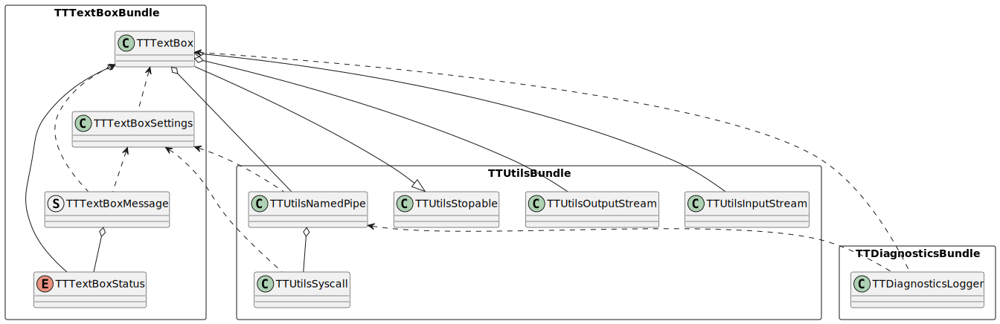
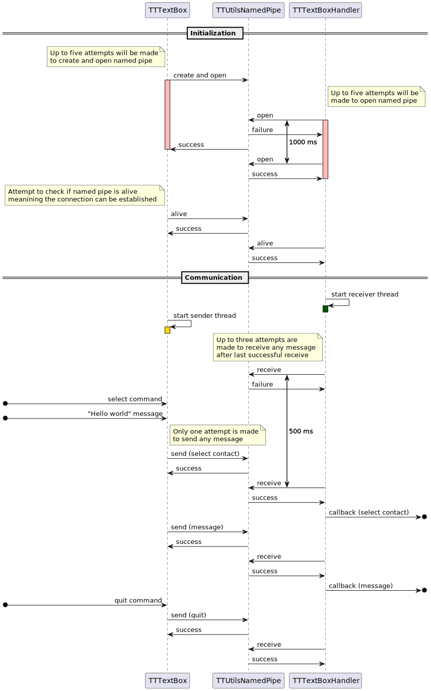

# Terminal Teams TextBox
## About
The purpose of this module is to:
- work as an user input interface
- serve as interactive part of the app chain

## Command line
Since this module implements an user input interface it's possible to send specific commands to the handler. Examples:
- `#help` - prints help message
- `#quit` - closes the application and handler
- `#select <id>` - selects specified contact
- `Hello world` - send casual message to the currently selected contact

## Architecture
This module consists of two main components:
- TTTextBox - binary, end user application (process)
- TTTextBoxHandler - library, receiver used in external binary (another process)

## Communication
Both components use IPC for communication (named pipe). Message types taking part in the flow:
- undefined (in case of error)
- heartbeat
- contacts selection
- message
- goodbye

Happy path of initialization and example communication can be found down below.

